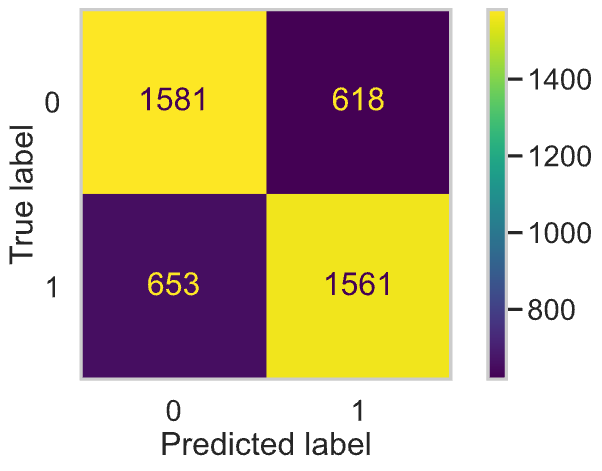

# Predicting League of Legends Results with Early Game Gold Data

by Monica Dai (mwdai@ucsd.edu)

---

## Introduction

Gold is the essential resource in League of Legends. Players need gold to purchase items that make them stronger, which helps them kill opponents and push towards victory in each game. In particular, the two teams’ difference in gold starts to matter early on in the game because the team with the gold lead can use that advantage to snowball into larger leads. The decisive role that gold has in the outcome of the game led me to focus my attention on data regarding gold stats, especially in terms of early game data.

In this project, I explore how players in each lane may demonstrate different dynamics with regards to gold stats, and look into how this relates to the final victory or loss. The data I used in this project is League of Legends 2023 Esports stats found on [Oracle's Elixir](https://oracleselixir.com/). The original dataset contains 125,904 rows and 131 columns. Each 12 rows in the dataset corresponds to one game, in which the first 10 are individual players’ data and the remaining 2 are rows of aggregated team data. Specifically, my question is: “How do individual early game gold stats play a factor into a team's final victory or loss?” The answer to this question will inform those who aren’t so familiar with League of Legends about its gameplay dynamics, positions that have the most impact on the game, and objectives that can better ensure victories.

The columns of interest to me are `gameid`, `league`, `side`, `position`, `playerid`, `champion`, `result`, `kills`, `goldat10`, `golddiffat10`, `goldat15`, `golddiffat15`. After dropping unrelated rows and columns, I am left with 88,260 rows and 12 columns.

**Description of Columns:**

`gameid`: a unique identification for each game in the dataset

`league`: the league in which the game takes place in

`side`: which side a player is on for the given game, either blue or red

`position`: the position a player played, either 'top', 'jng', 'mid', 'bot', or 'sup'

`playerid`: a unique identification for each professional player

`champion`: the name of the champion that the player chose for the given game

`result`: the final victory or loss, 1 means victory and 0 means loss

`kills`: the kills made by the player at 15 minutes into the game

`goldat10`: the gold earned at 10 minutes into the game

`golddiffat10`: the difference in gold between given player and their lane opponent at 10 minutes into the game

`goldat15`: the gold earned at 15 minutes into the game

`golddiffat15`: the difference in gold between given player and their lane opponent at 15 minutes into the game

## Data Cleaning and Exploratory Data Analysis

To start, I filtered the rows to only keep player data. That is, I performed a query on the DataFrame to only keep rows in which `position` did not equal 'team', meaning it was either 'top', 'jng', 'mid', 'bot', or 'sup'. I also filtered the columns to only keep the ones of interest: `gameid`, `league`, `side`, `position`, `playerid`, `champion`, `result`, `kills`, `goldat10`, `golddiffat10`, `goldat15`, `golddiffat15`. Lastly, I added columns `more_gold_at_10` and `more_gold_at_15` which denoted `True` if this player had more gold than their lane opponent 10 or 15 minutes into the game, and `False` if they had less. These two columns made grouping analyses easier.

I observed 16,660 rows in which gold data at 10 and 15 minutes was missing. I chose to drop these rows because I believe imputations would not be most appropriate in this scenario. I'm interested in the gold data of each player and how such data relates to the result, so if I were to perform imputations, I would want to fill in the null values which would closely resemble true values. To do so, I would ideally probabilistically impute conditional on `playerid`, since an individual's own data likely reflects their performance closest. However, players may have different performance when playing with different teammates and against different opponents, so arbitrarily imputing values could introduce impurities that don't reflect reality and interfere with further steps of analysis and predictions. Furthermore, there isn't enough data to impute on. That is, not many players with missing data had rows in which this data was not missing. Thus, I chose to drop these 16,660 rows with missing gold data in later parts of analysis, leaving me with 88,260 rows of player data.

The first five rows to the processed DataFrame are as follows:

|    | gameid                | league   | side   | position   | playerid                                  | champion   |   result |   killsat15 |   goldat10 |   golddiffat10 |   goldat15 |   golddiffat15 | more_gold_at_10   | more_gold_at_15   |
|---:|:----------------------|:---------|:-------|:-----------|:------------------------------------------|:-----------|---------:|------------:|-----------:|---------------:|-----------:|---------------:|:------------------|:------------------|
|  0 | ESPORTSTMNT06_2753012 | LFL2     | Blue   | top        | oe:player:60aff1184bec1d2b2efdae84f5b6e3e | Jax        |        1 |           0 |       3163 |             76 |       5059 |            322 | True              | True              |
|  1 | ESPORTSTMNT06_2753012 | LFL2     | Blue   | jng        | oe:player:fd78e127e45463dcfc2ea3836af0335 | Poppy      |        1 |           0 |       3035 |             87 |       4325 |           -357 | True              | False             |
|  2 | ESPORTSTMNT06_2753012 | LFL2     | Blue   | mid        | oe:player:baf7147fedeec5de54ca1f240952a3f | Taliyah    |        1 |           0 |       3117 |           -338 |       4956 |           -479 | False             | False             |
|  3 | ESPORTSTMNT06_2753012 | LFL2     | Blue   | bot        | oe:player:8204ca38dc1c42012b5d53131271eb1 | Ezreal     |        1 |           0 |       3344 |            329 |       5217 |            200 | True              | True              |
|  4 | ESPORTSTMNT06_2753012 | LFL2     | Blue   | sup        | oe:player:bb97cd2e43cb0855f6485e6f9e93ea2 | Karma      |        1 |           0 |       1953 |            -79 |       2827 |           -216 | False             | False             |

### Univariate Analysis

As the first step to EDA, I created a plot that visualizes the distribution of gold earned at 15 minutes for all players. I observed two peaks, roughly at the 3K and 5K gold marks. From prior knowledge, I know that Supports generally follow the Bot Laner into the bottom lane, and that they should be leaving last hits and kills to other players. Since last hits on minions and player kills all award gold, I believe this could explain the smaller peak at 3K gold, in that Supports will generally have less gold than the other players, thus forming its own peak. The other players seem to follow a more normalized distribution centered around 5K gold.

<iframe
  src="assets/uni-2.html"
  width="800"
  height="425"
  frameborder="0"
></iframe>

### Bivariate Analysis

To further explore the distribution of gold earned at 15 from above, I created a histogram facet grid for the distribution of gold earned at 15 for each position (top, jng, mid, bot, sup) and result (won, lost). All plots are on the same scale and follow a roughly normal distribution, though a little right skewness could be observed for the distributions of winning players (the first row of plots). The winning players' distributions (first row) also seem to have overall higher gold values than the losing players' distributions (second row), which makes sense because more gold seems to be tied with greater advantage. It's also noticeable that Supports, no matter the result, have distributions that are more centered around the mean than any other position. This observation brought me back to the gameplay patterns of Supports in which they generally leave last hits and kills to their teammates. This pattern could result in less variation in gold earned than other players, since Supports generally avoid the previously mentioned actions that gain gold. And as previously hypothesized, the gold distribution of Supports mostly lies in the 2-4K region, whereas the distribution of other positions mostly lies in the 4-6K region. This likely corresponds to the two peaks in the univariate analysis plot.

<iframe
  src="assets/bivar-2.html"
  width="850"
  height="425"
  frameborder="0"
></iframe>

### Interesting Aggregates

In searching for aggregates, I pivoted by the columns `more_gold_at_15` and `position`, taking the average of `result`. This evalutes to a table where I can examine the win rates of each position depending on if they had more or less gold than their lane opponent at 15 minutes. Since gold earned is a marker of advantage, it isn't difficult to see that those who had more gold (first row) had higher win rates than those who had less gold (second row).

| more_gold_at_15   |      bot |      jng |      mid |      sup |      top |
|:------------------|---------:|---------:|---------:|---------:|---------:|
| True              | 0.673164 | 0.633178 | 0.659186 | 0.663832 | 0.613327 |
| False             | 0.37426  | 0.40337  | 0.384426 | 0.381125 | 0.417681 |

To further examine these win rates, I took the difference in win rates between more gold and less gold to produce the following.

|      |      bot |      jng |      mid |      sup |      top |
|:-----|---------:|---------:|---------:|---------:|---------:|
| Diff in Win Rates | 0.298904 | 0.229808 | 0.274761 | 0.282708 | 0.195646 |

What caught my attention was the large difference between Bot Laners and Top Laners. There's a 10% gap between these two laners' difference in win rates, which led me to think that whether or not a Bot Laner had gold advantage might be significant in determining final result.

## Assessment of Missingness

**NMAR Analysis**

Many columns have missing data in the original DataFrame due to the aforementioned structure of the dataset where for each game, 10 rows correspond to players, and 2 correspond to teams. In some cases, it simply wouldn't make sense to have data in that column for player rows, such as pick order (`pick1`, `pick2`, `pick3`, `pick4`, `pick5`). The same goes for team rows, for columns such as `playerid` or `champion`.

However, I noticed that there were 21,015 values missing for `playername` and `playerid`, even though there were only 20,984 rows that corresponded to team data. After singling out the 31 player rows with missing values, the table below shows their related information. Since each player usually plays a designated position in each team, I hypothesize that these rows correspond to 5 or 6 individuals and their performance in different games, based off the values of `teamname` and `position`. I argue that `playername` and `playerid` are NMAR, meaning the missingness is due to the players themselves. 

I first rule out MD because it wouldn't make sense for data regarding player name and ID to be purposefully left out during data collection. I also don't believe it is MAR because just by looking at the other columns, I cannot determine the likelihood that the value is missing. There are other rows in which the same combination of `teamname` and `position` do indeed have player information. Lastly, I believe there are patterns discernable enough such that this data isn't simply MCAR. If it was MCAR, I would expect more variation in `teamname` and `position`, rather than the same individuals missing over multiple games despite their teammates' information being recorded. Thus, I believe there must have been some unknown reason related to the players themselves which led to missing `playername` and `playerid`, making these columns NMAR.

Additional data I would like to obtain that could potentially explain the missingness of `playerid` may include records of substitution or player abnormalities during given games. If a substitution took place, resulting in the original player's name to not be recorded and instead left as null, then the missingness of `playername` and `playerid` could become more explainable by looking into the data.

| gameid                | league   |   game | side   | position   |   playername |   playerid | teamname              | champion   |
|:----------------------|:---------|-------:|:-------|:-----------|-------------:|-----------:|:----------------------|:-----------|
| ESPORTSTMNT02_3161006 | PGN      |      1 | Blue   | mid        |          nan |        nan | DREN Esports          | Viktor     |
| ESPORTSTMNT02_3161035 | PGN      |      1 | Blue   | sup        |          nan |        nan | GGEsports             | Rakan      |
| ESPORTSTMNT02_3160621 | PGN      |      1 | Blue   | mid        |          nan |        nan | DREN Esports          | Syndra     |
| ESPORTSTMNT02_3170083 | PGN      |      1 | Red    | mid        |          nan |        nan | DREN Esports          | Viktor     |
| ESPORTSTMNT02_3171378 | PGN      |      1 | Red    | mid        |          nan |        nan | DREN Esports          | Syndra     |
| ESPORTSTMNT02_3169606 | PGN      |      1 | Red    | mid        |          nan |        nan | DREN Esports          | Kassadin   |
| ESPORTSTMNT05_3220607 | EM       |      5 | Blue   | top        |          nan |        nan | Los Heretics          | Rumble     |
| ESPORTSTMNT05_3220607 | EM       |      5 | Blue   | jng        |          nan |        nan | Los Heretics          | Vi         |
| 10062-10062_game_1    | LDL      |      1 | Red    | bot        |          nan |        nan | FunPlus Phoenix Blaze | Jinx       |
| 10062-10062_game_2    | LDL      |      2 | Blue   | bot        |          nan |        nan | FunPlus Phoenix Blaze | Aphelios   |
| 10062-10062_game_3    | LDL      |      3 | Blue   | bot        |          nan |        nan | FunPlus Phoenix Blaze | Zeri       |
| 10074-10074_game_1    | LDL      |      1 | Red    | bot        |          nan |        nan | FunPlus Phoenix Blaze | Zeri       |
| 10074-10074_game_2    | LDL      |      2 | Blue   | bot        |          nan |        nan | FunPlus Phoenix Blaze | Xayah      |
| ESPORTSTMNT03_3228169 | VCS      |      1 | Red    | sup        |          nan |        nan | APOLLO GAMING         | Nautilus   |
| ESPORTSTMNT03_3228183 | VCS      |      2 | Red    | sup        |          nan |        nan | APOLLO GAMING         | Leona      |
| ESPORTSTMNT03_3228197 | VCS      |      1 | Blue   | sup        |          nan |        nan | APOLLO GAMING         | Nautilus   |
| ESPORTSTMNT03_3228207 | VCS      |      2 | Red    | sup        |          nan |        nan | APOLLO GAMING         | Alistar    |
| ESPORTSTMNT03_3227713 | VCS      |      1 | Blue   | sup        |          nan |        nan | APOLLO GAMING         | Karma      |
| ESPORTSTMNT03_3228289 | VCS      |      2 | Red    | sup        |          nan |        nan | APOLLO GAMING         | Nautilus   |
| ESPORTSTMNT03_3227716 | VCS      |      3 | Blue   | sup        |          nan |        nan | APOLLO GAMING         | Leona      |
| ESPORTSTMNT03_3227720 | VCS      |      4 | Red    | sup        |          nan |        nan | APOLLO GAMING         | Rell       |
| ESPORTSTMNT03_3228292 | VCS      |      5 | Blue   | sup        |          nan |        nan | APOLLO GAMING         | Rell       |
| ESPORTSTMNT03_3228324 | VCS      |      1 | Blue   | sup        |          nan |        nan | APOLLO GAMING         | Bard       |
| ESPORTSTMNT03_3227765 | VCS      |      2 | Red    | sup        |          nan |        nan | APOLLO GAMING         | Rakan      |
| ESPORTSTMNT03_3226799 | VCS      |      3 | Blue   | sup        |          nan |        nan | APOLLO GAMING         | Rakan      |
| ESPORTSTMNT03_3227767 | VCS      |      4 | Blue   | sup        |          nan |        nan | APOLLO GAMING         | Tahm Kench |
| ESPORTSTMNT03_3226802 | VCS      |      5 | Red    | sup        |          nan |        nan | APOLLO GAMING         | Nautilus   |
| ESPORTSTMNT03_3226815 | VCS      |      1 | Red    | sup        |          nan |        nan | APOLLO GAMING         | Karma      |
| ESPORTSTMNT03_3226816 | VCS      |      2 | Red    | sup        |          nan |        nan | APOLLO GAMING         | Tahm Kench |
| ESPORTSTMNT03_3227787 | VCS      |      3 | Blue   | sup        |          nan |        nan | APOLLO GAMING         | Bard       |
| ESPORTSTMNT03_3226818 | VCS      |      4 | Blue   | sup        |          nan |        nan | APOLLO GAMING         | Nautilus   |

**Missingness Dependency**

However, a friend who watches professional League of Legends matches told me that different leagues may have different data collection processes. I noticed that many rows had missing values for the data related to 10 and 15 minutes into the game, such as `xpat10`, `goldat15`, etc. I believed that the missingness of `goldat15` could be dependent on `league`, and conducted a permutation test with significance level at 0.05.

**Null hypothesis**: missingness of `goldat15` is not dependent on `league`

**Alternative hypothesis**: missingness of `goldat15` is dependent on `league`

<iframe
  src="assets/mar-bar.html"
  width="850"
  height="425"
  frameborder="0"
></iframe>

The above figures show the distribution of leagues by missingness of gold. The test statistic used in this permutation test was TVD of league distribution between gold missing and not missing. The observed test statistic was calculated to be 0.9915, and the below histogram shows the distribution of simulated TVDs compared to the observed TVD. As can be seen, no simulated TVDs were nearly as high as what was observed, so the p-value is 0, which is lower than the significance level of 0.05. We thus **reject** the null hypothesis which postulates that the missingness of `goldat15` is not dependent on `league`. 

<iframe
  src="assets/mar-distribution.html"
  width="850"
  height="425"
  frameborder="0"
></iframe>

---

As for a column that missingness of `goldat15` does not depend on, I chose to examine the missingness dependency of `goldat15` on `result`. I conducted another permutation test with significance level at 0.05.

**Null hypothesis**: missingness of `goldat15` is not dependent on `result`

**Alternative hypothesis**: missingness of `goldat15` is dependent on `result`

The test statistic used in this permutation test was difference in win rates between players whose gold is missing and players whose gold is not missing. The observed test statistic was calculated to be 0.0003, and the below histogram shows the distribution of simulated differences in win rates. There are plenty of observed test statistics where the difference in win rate was greater than the observed difference, and the p-value is 0.95. Since the p-value is greater than the significance level, 0.05, we **fail to reject** the null hypothesis which poses that missingness of `goldat15` is not dependent on `result`.

<iframe
  src="assets/mar-diffmeans.html"
  width="850"
  height="425"
  frameborder="0"
></iframe>

## Hypothesis Testing

From the previous section, I noticed that Bottom Laners had the greatest difference in win rates between those who had a gold advantage at 15 minutes and those who did not. Thus, in this section about hypothesis testing, I'm interested in observing how early game advantages may snowball into greater advantages for Bottom Laners, using kills at 15 as a metric. I chose to use kills at 15 because in the game, more kills generally translates to a greater advantage. Also, important factors such as barons and souls are not yet relevant at the 15 minute mark, thus ruling out some potential confounding factors.

**Question**: Do Bottom Laners with more gold get more kills early in the game?

**Null Hypothesis**: Early in the game, Bottom Laners with a gold advantage get roughly the same number of kills as those without.

**Alternative Hypothesis**: Early in the game, Bottom Laners with a gold advantage get more kills than those without.

**Test Statistic**: Difference in mean kills at 15 minutes between Bottom Laners who had more gold at 10 minutes and Bottom Laners who did not (With Gold Advantage - No Gold Advantage).

**Significance Level**: 0.05

This permutation test would be able to compare the kills between Bottom Laners with and without an early gold advantage. Assuming the null hypothesis, we expect the test statistic to be approximately 0. A test statistic pointing towards the alternative hypothesis would be a positive number, since Bottom Laners with gold advantage would have more kills than those without advantage.

The distribution of simulated test statistics compared to the observed test statistic is displayed below. As can be seen, the observed statistic is 0.797 and is much greater than any of the test statistics simulated under the null hypothesis, which are indeed centered approximately at 0. The p-value is 0, so we **reject** the null hypothesis that there is no difference between the kills at 15 made by Bottom Laners with and without gold advantage at 10. This suggests that a gold advantage may indeed indicate potential snowballing of advantages through more kills than those without advantage.

<iframe
  src="assets/hypothesis-test.html"
  width="800"
  height="425"
  frameborder="0"
></iframe>

---
---

## Framing a Prediction Problem

In terms of prediction, the outcome of the game is probably what people care about most. From my previous analysis, it seems that gold accumulation could be important in determining Bottom Laners' advantage and thus final result of a game. Thus, I plan to use Bottom Laners' early game data to predict their result. This is a binary classification problem where I try to predict `result`, which takes on either 0, which corresponds to a loss, or 1, which corresponds to a victory. I will be using accuracy to evaluate my model. I chose accuracy over F-1 score because recall and precision aren’t too important in this scenario, since the consequences of incorrect predictions aren’t very severe. Accuracy is also appropriate in this case because I have balanced data–the proportion of wins to losses is very similar, essentially 50-50.

Before I can build my model, I first clean out unnecessary rows and columns such that only relevant **early game** Bottom Laner data is remaining. I had to make sure to drop any information that would only be known after the game ends. To engineer a new feature for the Final Model, I also added the columns `teamgoldat10` and `teamgoldat15`, which represent each player's team gold at 10, 15 minutes. The first five rows of the cleaned DataFrame look like this:

| champion   |   result |   killsat15 |   goldat10 |   goldat15 |   golddiffat10 |   golddiffat15 |   teamgoldat10 |   teamgoldat15 |
|:-----------|---------:|------------:|-----------:|-----------:|---------------:|---------------:|---------------:|---------------:|
| Ezreal     |        1 |           0 |       3344 |       5217 |            329 |            200 |          14612 |          22384 |
| Zeri       |        0 |           1 |       3015 |       5017 |           -329 |           -200 |          14537 |          22914 |
| Lucian     |        0 |           2 |       3573 |       5706 |           -304 |            175 |          15969 |          24771 |
| Draven     |        1 |           1 |       3877 |       5531 |            304 |           -175 |          16330 |          24098 |
| Varus      |        1 |           0 |       3045 |       4892 |            -73 |             53 |          14794 |          22945 |

## Baseline Model

For my Baseline Model, I decided to use a RandomForestClassifier on the two columns `goldat10` and `goldat15`, which represent the amount of gold each Bottom Laner had at the 10 and 15 minute mark in a game. I was curious to see how well my model could predict `result` based on these two quantitative features alone. I used the columns as is and didn't need to perform any encodings. Below is a preview of the data I used to train my Baseline Model.

|   result |   goldat10 |   goldat15 |
|---------:|-----------:|-----------:|
|        1 |       3344 |       5217 |
|        0 |       3015 |       5017 |
|        0 |       3573 |       5706 |
|        1 |       3877 |       5531 |
|        1 |       3045 |       4892 |

My model achieved a training accuracy of 84.55%, and a testing accuracy of 59.89%. My current model is better than a random guess, but I wouldn't say it is a "good" model since there are other features I may incorporate to increase the model's accuracy on unseen data.

## Final Model

In the Final Model, I aim to increase my model's performance by introducing the following new features:

`champion`: `OneHotEncoder()`, certain Bottom Lane champions may have an advantage over others, increasing the possibility of victory.

`golddiffat10`, `golddiffat15`: `Binarizer()` & `MinMaxScaler()`, these features are binary, where 1 corresponds to having more gold than lane opponent and 0 corresponds to not having more gold than lane opponent. This feature indicates an early gold advantage over the opponent, whereas the original features of my Baseline Model did not provide such a comparison. As observed from previous parts, early gold advantages may be an important factor in determining victory.

`goldshareat10`, `goldshareat15`: `FunctionTransformer()` & `MinMaxScaler()`, these quantitative features indicate the Bottom Laner's share of gold within their team. If the value of this feature is much higher or lower than average, it may indicate that something in the teamplay is abnormal, e.g. someone is carrying, and that the team is at disadvantage.

`killsat15`: `MinMaxScaler()`, kill data is a direct indicator of advantage, so more kills may suggest higher win rate. Only including kills at the 15 minute mark to restrict to early game data.

Applied MinMaxScaler() to the numerical features to handle different scales and magnitudes between gold, goldshares, binary features, and kills.

**Model and Hyperparameter Choice**: I chose to continue using a RandomForestClassifier for my Final Model since I had a classification problem. I chose optimal hyperparameters using GridSearchCV, and the results were 'rfc__max_depth': 20, 'rfc__max_features': 'sqrt', 'rfc__min_samples_split': 2, 'rfc__n_estimators': 100. The Best test score produced by my grid search was actually lower than my model's test accuracy following the initial hyperparameter values. I believe this could potentially be because the hyperparameters tuned by the GridSearchCV may not be optimal for the test data.

**Final Model Performance**: My Final Model achieved training accuracy of 98.87% and testing accuracy of 71.20%. It demonstrated a 11.31% increase compared to the Baseline Model's testing accuracy. Incorporating new features which provided comparisons in terms of advantage seemed to have indeed increased the model's ability to predict outcomes. A potential inherent limitation to this model is that it only makes predictions on early game data, and does not have access to other factors which are also heavy influencers of a team's victory, such as baron kills and souls.

Below is a confusion matrix of my Final Model's predictions. Of 4,413 predictions, it correctly predicted the victory of 1,561 teams and loss of 1581 teams. It incorrectly predicted that 653 teams would lose even though they actually won, and predicted that 618 teams would win even though they actually lost.

## Fairness Analysis

**Question**: Does my model perform similarly for Bottom Laners on both sides, red and blue?

**Null Hypothesis**: My model is fair. Its accuracy for predicting the result of blue teams and red teams are roughly the same, and any differences are due to random chance.

**Alternative Hypothesis**: My model is unfair. Its accuracy for predicting the result of blue teams and red teams are significantly different.

**Test Statistic**: Difference in Accuracy

**Significance Level**: 0.05

After performing a permutation test to assess the accuracy parity of my model, the following histogram depicts the distribution of differences in accuracy. The p-value was 0.665, which is greater than the significance level, so we **fail to reject** the null hypothesis which poses that my model is fair and that any differences in accuracy between Bottom Laners on blue teams and red teams is due to random chance.

<iframe
  src="assets/fairness.html"
  width="800"
  height="425"
  frameborder="0"
></iframe>

